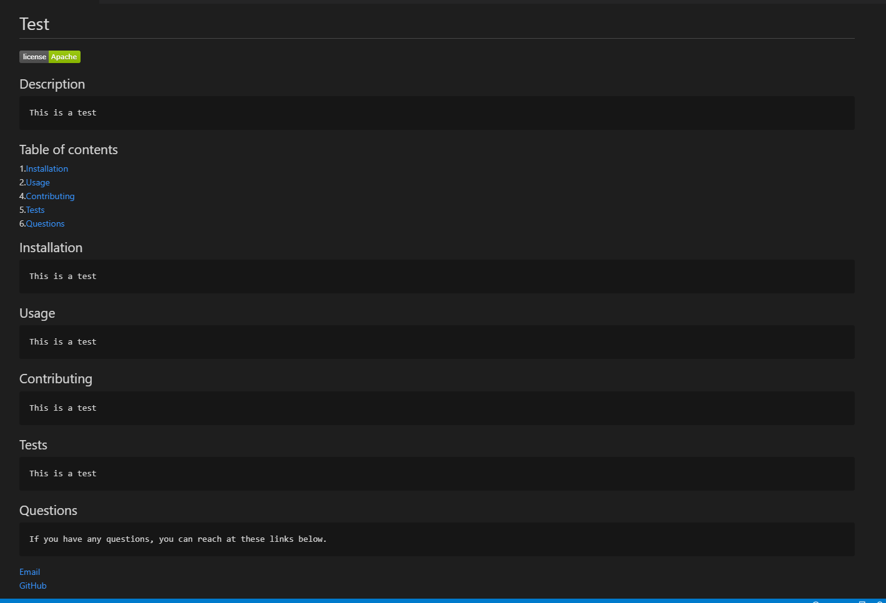

## README Generator

## Application-Picture


## Technologies Used
    - Javascript - Used to make write the functions of the application
    - Git - Version control system to track changes to source code.
    - GitHub - Hosts repositroy that can be deployed to GitHub pages.


## Summary
    Built an application that will capture user input through the console and dynamically create a README.md file from the captured information.


## Code Snippet
    Below will be a very small snippit from the function that will dynamically create the Readme.md. The const fileData at the end is the contents of the generated file.
``` function init() {
    inquirer
        .prompt(questions)
        .then((data) => {
            const filename = 'README.md';
            let licenseBadge = () =>  (data.license === 'None' ? '' :  ``);
            const fileData =
```


## Author Links
[LinkedIn](https://www.linkedin.com/in/liamsctewart/)<br>
[Github](https://github.com/LiamStewart8)<br>
[Application Video](https://www.dropbox.com/s/a7xmxowiuc2ixto/Demonstration.mp4?dl=0)